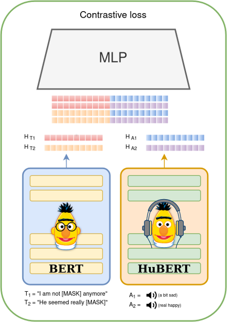
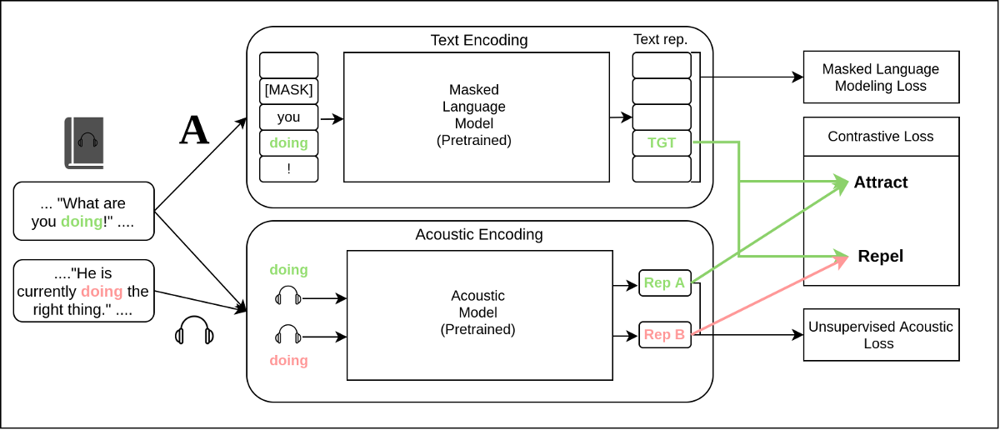

# AuBERT: Contrastive Learning for Cross-modal Speech and Language Representations

AUBERT is a contrastive learning framework, which improves both audio and text representations.



The architecture of **AuBERT**. We employ two encoders, one for audio and another for text. After obtaining the hidden representation H_T and H_A for our inputs, we concatenate all possible [H_T; H_A] pairs and feed them into a similarity scorer network (MLP).

## Pre-training 



Our proposed model has a backbone consisting of two branches for each of the modalities. For encoding text, a pretrained language model such as BERT [(Devlin et al. 2019)](https://aclanthology.org/N19-1423/) is used. For processing audio, a pretrained language model such as HuBERT [(Hsu et al. 2021)](https://arxiv.org/abs/2106.07447) is used. 

The model is trained to make the representations of tokens close to their respective utterances in the same context, while making the representations far from utterances of the same token, but in different contexts. The motivation for using utterances of the same token in both scenarios is to eliminate the ability of the model to simply rely on the pronunciation of the word. Instead, the model is encouraged to learn additional features such as emotion and pitch from the textual context alone in order to correctly identify the correct utterance. 

## Dataset preparation

The data required for pre-training is a bit difficult to obtain, as we need audio utterances of the same speaker with their transcriptions in text. For this purpose we utilize the [libri-light](https://github.com/facebookresearch/libri-light/) dataset, which is a set of processed audio-books from the [LibriVox](librivox.org/) project. Then, we download the corresponding book texts and align the utterances on word level automatically. This way our dataset could be used for training ASR systems as well.

To reproduce the dataset follow these steps (You will need around 1 Tbyte in total):

- Clone and install requirements:

```
git clone https://github.com/alisafaya/aubert.git
cd aubert/
pip install -r req.txt
```

- First download the dataset and cut the files by Voice Activity. We use the medium version of the dataset:

```
wget https://dl.fbaipublicfiles.com/librilight/data/medium.tar
tar -xf medium.tar -C medium
rm medium.tar
python scripts/cut_by_vad.py --input_dir medium/ --output_dir cut-medium/
```

- Download LibriVox books raw text [here](https://drive.google.com/file/d/12gVt7Pr3KdLWFnnVdw81ygugJEQk46le/view?usp=sharing), and place under `data/`:

```
mkdir bin/
cd bin/
mv [dir to downloaded librivox-books.zip] .
unzip librivox-books.zip
```

- Produce transcriptions of audio files, (you can utilize the `rank` argument for multi-node):

```
wget https://www.openslr.org/resources/11/3-gram.pruned.1e-7.arpa.gz
gunzip 3-gram.pruned.1e-7.arpa.gz
cd ..
mkdir transcriptions/
for rank in {0..8}; do python scripts/predict_transformers.py --input-dir cut-medium/ --output-dir transcriptions/ --lm-path bin/3-gram.pruned.1e-7.arpa --batch-size 4 --device cuda --num-speakers 200 --rank $rank;done
cat transcriptions/*.tsv > bin/medium_transciptions.tsv
rm -rf transcriptions/
```

- Apply pre-alignment for on utterance level:

This will run 24 workers for aligning the audio files on utterance level.

```
mkdir alignments/
python scripts/match_utterances_to_books.py -u bin/medium_transcriptions.tsv -p 24 -o alignments/ -b bin/librivox-books/ -m data/book_meta.json
```

- Refine alignments using Levenshtein distance:

```
python scripts/refine_alignments.py -i alignments/ -o alignments/
```

- Apply alignment for on word level:

```
python scripts/align_words.py -i alignments/ -o data/aligned/
```

## Running Pre-training 

- First prepare the data batches for pre-training

```
python aubert/prepare_data.py --alignments data/aligned/ --output-dir bin/out-data/ --max-ngram-size 3 --audio-dir cut-medium/
```

Arguments:

```
optional arguments:
  --alignments ALIGNMENTS
                        Directory to The JSON files for word-level aligned book data as prepared in the preprocessing step
  --audio-dir AUDIO_DIR
                        Directory to the audio files
  --audio-processor AUDIO_PROCESSOR
                        The audio processor to use for preprocessing and padding audio segments
  --chunk-size CHUNK_SIZE
                        The max samples to save at a data batch
  --max-seq-length MAX_SEQ_LENGTH
                        The maximum sequence length of utterance contexts
  --mask-ratio MASK_RATIO
                        The ratio of masked tokens in the input sequence
  --max-ngram-size MAX_NGRAM_SIZE
                        The size of n-grams to use for pre-training AuBERT
  --min-utter-per-speaker MIN_UTTER_PER_SPEAKER
                        The minimum number of utterances per speaker to include in the dataset
  --min-ngram-occurrences MIN_NGRAM_OCCURRENCES
                        The minimum number of times a n-gram must occur in the dataset to be included
  --min-audio-length MIN_AUDIO_LENGTH
                        The minimum length of audio segments to include in the dataset
  --max-samples-per-ngram MAX_SAMPLES_PER_NGRAM
                        The maximum number of samples per n-gram to include in the dataset
  --max-ngrams-per-speaker MAX_NGRAMS_PER_SPEAKER
                        The maximum number of samples per n-gram to include in the dataset
  --num-workers NUM_WORKERS
                        The number of workers to use for data loading
  --output-dir OUTPUT_DIR
                        Directory to save the output
  --tokenizer TOKENIZER
                        The tokenizer to use for tokenization
  --rank RANK           Rank of the current process
  --world_size WORLD_SIZE
                        World size: total nodes

```

Run training on a single batch:

```
python -m aubert.trainer --train_dir bin/aubert-data/train/1.pt --val_dir bin/aubert-data/train/1.pt --epochs 5
```


## Evaluation

```

```